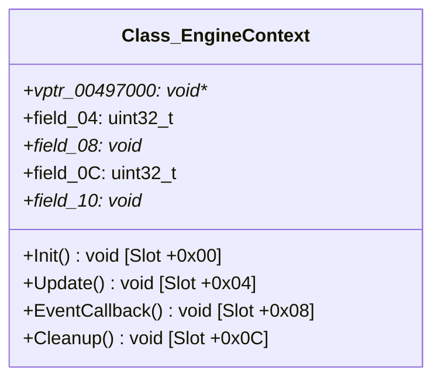

# ALICE GREENFINGERS - CLASS RELATIONSHIP BLUEPRINT (STEP 5)

*Generated on 2026-09-01 13:47:43*

## VTABLE / CLASS RELATIONSHIP GRAPH

```mermaid
classDiagram
    class Class_EngineContext {
        +vptr_00497000: void**
        +field_04: uint32_t
        +field_08: void*
        +field_0C: uint32_t
        +field_10: void*
        +Init() void [Slot +0x00]
        +Update() void [Slot +0x04]
        +EventCallback() void [Slot +0x08]
        +Cleanup() void [Slot +0x0C]
    }
```
