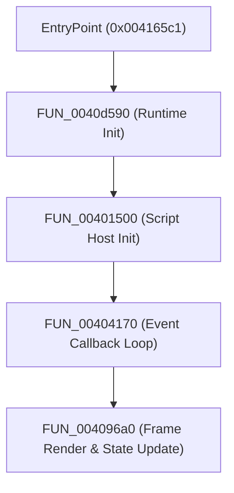

# ALICE GREENFINGERS - FULL BINARY CALL GRAPH (STEP 7)

*Generated on 2026-09-01 13:13:34*

## SUBSYSTEM CALL GRAPH SUMMARY
- **Total Functions Cataloged in Call Graph:** 1,846

### Core Engine Entry & Execution Chain

## DETAILED CALL TABLE

| Function Identifier | Address RVA | Line Count | Direct Subroutine Callees | Call Chain Role |
| --- | --- | --- | --- | --- |
| `FUN_00401000` | `0x00401000` | 21 | `FUN_00401000` | Subsystem Execution Node |
| `FUN_00401070` | `0x00401070` | 24 | `FUN_004111dc`, `FUN_00401070` | Subsystem Execution Node |
| `FUN_004010a0` | `0x004010a0` | 31 | `FUN_004010a0` | Subsystem Execution Node |
| `FUN_004010e0` | `0x004010e0` | 11 | `FUN_00401100`, `FUN_004010e0` | Subsystem Execution Node |
| `FUN_00401100` | `0x00401100` | 80 | `FUN_0040e0c0`, `FUN_0040f190`, `FUN_00401000`, `FUN_00401a50` | Subsystem Execution Node |
| `FUN_00401250` | `0x00401250` | 47 | `FUN_00401b80`, `FUN_00401250` | Subsystem Execution Node |
| `FUN_004012f0` | `0x004012f0` | 23 | `FUN_004109e0`, `FUN_004012f0`, `FUN_00402250`, `FUN_00401380` | Subsystem Execution Node |
| `FUN_00401350` | `0x00401350` | 17 | `FUN_00401350`, `FUN_004111dc` | Subsystem Execution Node |
| `FUN_00401380` | `0x00401380` | 13 | `FUN_00401350`, `FUN_00401070`, `FUN_00401380` | Subsystem Execution Node |
| `FUN_004013a0` | `0x004013a0` | 20 | `FUN_004013a0` | Subsystem Execution Node |
| `FUN_004013c0` | `0x004013c0` | 21 | `FUN_004013a0`, `FUN_004013c0` | Subsystem Execution Node |
| `FUN_00401400` | `0x00401400` | 21 | `FUN_00401400`, `FUN_00402250`, `FUN_00401380`, `FUN_00410640` | Subsystem Execution Node |
| `FUN_00401460` | `0x00401460` | 32 | `FUN_0040d440`, `FUN_00402160`, `FUN_00401460`, `FUN_00402400` | Subsystem Execution Node |
| `FUN_00401500` | `0x00401500` | 333 | `FUN_0045e737`, `FUN_004010a0`, `FUN_00410bf0`, `FUN_004279bf` | Subsystem Execution Node |
| `FUN_00401960` | `0x00401960` | 15 | `FUN_00401960`, `FUN_00402250` | Subsystem Execution Node |
| `FUN_00401980` | `0x00401980` | 36 | `FUN_00432929`, `FUN_00403e10`, `FUN_00401980` | Subsystem Execution Node |
| `FUN_004019d0` | `0x004019d0` | 28 | `FUN_004019d0`, `FUN_004111dc`, `FUN_00402250` | Subsystem Execution Node |
| `FUN_00401a10` | `0x00401a10` | 25 | `FUN_00403c30`, `FUN_00402160`, `FUN_00401a10` | Subsystem Execution Node |
| `FUN_00401a50` | `0x00401a50` | 49 | `FUN_00465124`, `FUN_00442a67`, `FUN_00401a50`, `FUN_00408f40` | Subsystem Execution Node |
| `FUN_00401b10` | `0x00401b10` | 39 | `FUN_00401b10` | Subsystem Execution Node |
| `FUN_00401b80` | `0x00401b80` | 55 | `FUN_0040e0a0`, `FUN_00402160`, `FUN_004013c0`, `FUN_00402250` | Subsystem Execution Node |
| `FUN_00401c90` | `0x00401c90` | 17 | `FUN_00401c90`, `FUN_004026f0` | Subsystem Execution Node |
| `FUN_00401cb0` | `0x00401cb0` | 132 | `FUN_00410a70`, `FUN_004109a0`, `FUN_0040da90`, `FUN_0040e750` | Subsystem Execution Node |
| `FUN_00401f20` | `0x00401f20` | 124 | `FUN_0040e0a0`, `FUN_004019d0`, `FUN_0040e6a0`, `FUN_00402560` | Subsystem Execution Node |
| `FUN_00402160` | `0x00402160` | 42 | `FUN_0040c600`, `FUN_00403bd0`, `FUN_00402160`, `FUN_004013a0` | Subsystem Execution Node |
| `FUN_00402250` | `0x00402250` | 15 | `FUN_004111dc`, `FUN_00402250` | Subsystem Execution Node |
| `FUN_00402280` | `0x00402280` | 31 | `FUN_004431ad`, `FUN_00402280` | Subsystem Execution Node |
| `FUN_004022d0` | `0x004022d0` | 88 | `FUN_004111dc`, `FUN_004022d0`, `FUN_0044c7c0` | Subsystem Execution Node |
| `FUN_00402400` | `0x00402400` | 84 | `FUN_0040d530`, `FUN_00402880`, `FUN_00402400`, `FUN_004022d0` | Subsystem Execution Node |
| `FUN_00402560` | `0x00402560` | 120 | `FUN_004019d0`, `FUN_00402560`, `FUN_00402160`, `FUN_00401c90` | Subsystem Execution Node |
| `FUN_004026f0` | `0x004026f0` | 27 | `FUN_00446618`, `FUN_004013a0`, `FUN_004026f0` | Subsystem Execution Node |
| `FUN_00402710` | `0x00402710` | 37 | `FUN_004111dc`, `FUN_00402710` | Subsystem Execution Node |
| `FUN_00402780` | `0x00402780` | 73 | `FUN_004111dc`, `FUN_00402780` | Subsystem Execution Node |
| `FUN_00402880` | `0x00402880` | 353 | `FUN_00402f00`, `FUN_004031b0`, `FUN_00402710`, `FUN_00402f80` | Subsystem Execution Node |
| `FUN_00402e0a` | `0x00402e0a` | 335 | `FUN_00402f00`, `FUN_00402710`, `FUN_00402f80`, `FUN_004031b0` | Subsystem Execution Node |
| `FUN_00402f00` | `0x00402f00` | 67 | `FUN_004111dc`, `FUN_00402f00` | Subsystem Execution Node |
| `FUN_00402f80` | `0x00402f80` | 66 | `FUN_00460879`, `FUN_00402f00`, `FUN_00402f80`, `FUN_00446618` | Subsystem Execution Node |
| `FUN_00403020` | `0x00403020` | 32 | `FUN_00403020`, `FUN_004013a0`, `FUN_00402f00`, `FUN_00446618` | Subsystem Execution Node |
| `FUN_00403060` | `0x00403060` | 58 | `FUN_00403060`, `FUN_00402710`, `FUN_004026f0`, `FUN_00403020` | Subsystem Execution Node |
| `FUN_004031b0` | `0x004031b0` | 147 | `FUN_004273df`, `FUN_004031b0`, `FUN_00402710`, `FUN_00432cc2` | Subsystem Execution Node |
| `FUN_00403350` | `0x00403350` | 35 | `FUN_00403350` | Subsystem Execution Node |
| `FUN_004033c0` | `0x004033c0` | 209 | `FUN_0040da60`, `FUN_00403af0`, `FUN_00402250`, `FUN_004037a0` | Subsystem Execution Node |
| `FUN_0040373c` | `0x0040373c` | 21 | `FUN_004111dc`, `FUN_00402250`, `FUN_0040da20`, `FUN_0040373c` | Subsystem Execution Node |
| `FUN_004037a0` | `0x004037a0` | 150 | `FUN_00434a13`, `FUN_00444dd6`, `FUN_00403910`, `FUN_0040df90` | Subsystem Execution Node |
| `FUN_00403910` | `0x00403910` | 45 | `FUN_0040e050`, `FUN_00403910` | Subsystem Execution Node |
| `FUN_004039a0` | `0x004039a0` | 60 | `FUN_004039a0` | Subsystem Execution Node |
| `FUN_00403a20` | `0x00403a20` | 112 | `FUN_00403a20`, `FUN_00444bbb`, `FUN_00444b5f`, `FUN_00410160` | Subsystem Execution Node |
| `FUN_00403a50` | `0x00403a50` | 40 | `FUN_00403a50`, `FUN_004111dc` | Subsystem Execution Node |
| `FUN_00403af0` | `0x00403af0` | 27 | `FUN_00403af0`, `FUN_004111dc`, `FUN_00403b70`, `FUN_00403350` | Subsystem Execution Node |
| `FUN_00403b70` | `0x00403b70` | 36 | `FUN_00446618`, `FUN_00403b70`, `FUN_0040c600`, `FUN_00403bd0` | Subsystem Execution Node |
| `FUN_00403bd0` | `0x00403bd0` | 32 | `FUN_00403bd0`, `FUN_004111dc` | Subsystem Execution Node |
| `FUN_00403c30` | `0x00403c30` | 27 | `FUN_00403bd0`, `FUN_00403c30` | Subsystem Execution Node |
| `FUN_00403c90` | `0x00403c90` | 16 | `FUN_00403c90`, `FUN_00403cc0` | Subsystem Execution Node |
| `FUN_00403cc0` | `0x00403cc0` | 15 | `FUN_00403cc0` | Subsystem Execution Node |
| `FUN_00403cd0` | `0x00403cd0` | 18 | `FUN_00408f40`, `FUN_00403cd0`, `FUN_00403cc0` | Subsystem Execution Node |
| `FUN_00403d10` | `0x00403d10` | 19 | `FUN_00403d10`, `FUN_00404170`, `FUN_00408f40`, `FUN_00403cd0` | Subsystem Execution Node |
| `FUN_00403d80` | `0x00403d80` | 16 | `FUN_004431ad`, `FUN_00403d80` | Subsystem Execution Node |
| `FUN_00403da0` | `0x00403da0` | 37 | `FUN_00403ea0`, `FUN_00403da0`, `FUN_0040bcc0` | Subsystem Execution Node |
| `FUN_00403e10` | `0x00403e10` | 45 | `FUN_00403ea0`, `FUN_00403da0`, `FUN_00403e10`, `FUN_0040b960` | Subsystem Execution Node |
| `FUN_00403ea0` | `0x00403ea0` | 164 | `FUN_00403ea0`, `FUN_0040bc70` | Subsystem Execution Node |
| `FUN_00404100` | `0x00404100` | 37 | `FUN_00404100`, `FUN_00404170` | Subsystem Execution Node |
| `FUN_00404170` | `0x00404170` | 2,408 | `FUN_00404170` | Subsystem Execution Node |
| `FUN_00408cc0` | `0x00408cc0` | 62 | `FUN_00403d10`, `FUN_00404170`, `FUN_00408f40`, `FUN_00408d90` | Subsystem Execution Node |
| `FUN_00408d90` | `0x00408d90` | 61 | `FUN_0040ba10`, `FUN_00408f40`, `FUN_00408d90`, `FUN_0040a780` | Subsystem Execution Node |
| `FUN_00408e80` | `0x00408e80` | 129 | `FUN_0044b8a3`, `FUN_00408f40`, `FUN_00470870`, `FUN_004111dc` | Subsystem Execution Node |
| `FUN_00408f40` | `0x004108f0` | 53 | `FUN_0040e270`, `FUN_0044b3d9`, `FUN_00408f40`, `FUN_0044318e` | Subsystem Execution Node |
| `FUN_00408fc0` | `0x00408fc0` | 185 | `FUN_0040c4e0`, `FUN_0047faae`, `FUN_00402250`, `FUN_0040bd20` | Subsystem Execution Node |
| `FUN_004091b0` | `0x004091b0` | 200 | `FUN_00431dc9`, `FUN_00402160`, `FUN_00402710`, `FUN_0046fe32` | Subsystem Execution Node |
| `FUN_004091e0` | `0x004091e0` | 481 | `FUN_0040f190`, `FUN_0047faae`, `FUN_00402250`, `FUN_0047d33e` | Subsystem Execution Node |
| `FUN_004096a0` | `0x004096a0` | 1,869 | `FUN_00453443`, `FUN_0040e1c0`, `FUN_0040c4e0`, `FUN_00402710` | Subsystem Execution Node |
| `FUN_0040a780` | `0x0040a780` | 1,050 | `FUN_004530c9`, `FUN_0040b5f0`, `FUN_0040c1f0`, `FUN_00402250` | Subsystem Execution Node |
| `FUN_0040afa0` | `0x0040afa0` | 695 | `FUN_0045e951`, `FUN_0040f4d0`, `FUN_00443006`, `FUN_0047f9a6` | Subsystem Execution Node |
| `FUN_0040b400` | `0x0040b400` | 65 | `FUN_0040e270`, `FUN_0044b3d9`, `FUN_0044318e`, `FUN_0040b400` | Subsystem Execution Node |
| `FUN_0040b510` | `0x0040b510` | 106 | `FUN_00443106`, `FUN_0040baa0`, `FUN_00408f40`, `FUN_00452f05` | Subsystem Execution Node |
| `FUN_0040b5f0` | `0x0040b5f0` | 374 | `FUN_004530c9`, `FUN_0040b5f0`, `FUN_004259eb`, `FUN_0040bd20` | Subsystem Execution Node |
| `FUN_0040b910` | `0x0040b910` | 39 | `FUN_00408f40`, `FUN_0040b910`, `FUN_004111dc`, `FUN_0044b911` | Subsystem Execution Node |
| `FUN_0040b960` | `0x0040b960` | 129 | `FUN_0040b960`, `FUN_0044b8a3`, `FUN_004111dc`, `FUN_00470870` | Subsystem Execution Node |
| `FUN_0040ba10` | `0x0040ba10` | 37 | `FUN_0040b960`, `FUN_004111dc`, `FUN_0040ba10` | Subsystem Execution Node |
| `FUN_0040baa0` | `0x0040baa0` | 39 | `FUN_00432cc2`, `FUN_0040baa0` | Subsystem Execution Node |
| `FUN_0040bb00` | `0x0040bb00` | 41 | `FUN_0040bb00`, `FUN_004431ad`, `FUN_0040baa0`, `FUN_00408f40` | Subsystem Execution Node |
| `FUN_0040bb80` | `0x0040bb80` | 63 | `FUN_0040baa0`, `FUN_00452f05`, `FUN_0040bb80`, `FUN_00443006` | Subsystem Execution Node |
| `FUN_0040bc10` | `0x0040bc10` | 40 | `FUN_0040b960`, `FUN_0040bc10`, `FUN_00408e80` | Subsystem Execution Node |
| `FUN_0040bc70` | `0x0040bc70` | 26 | `FUN_0040bc70` | Subsystem Execution Node |
| `FUN_0040bcc0` | `0x0040bcc0` | 45 | `FUN_0040d260`, `FUN_0040bcc0` | Subsystem Execution Node |
| `FUN_0040bd20` | `0x0040bd20` | 36 | `FUN_004531b1`, `FUN_0040bd20`, `FUN_0045e987`, `FUN_0040b510` | Subsystem Execution Node |
| `FUN_0040bd50` | `0x0040bd50` | 22 | `FUN_0040e0a0`, `FUN_0040bd80`, `FUN_00402250`, `FUN_0044cde9` | Subsystem Execution Node |
| `FUN_0040bd80` | `0x0040bd80` | 56 | `FUN_0040bd80`, `FUN_00402f00` | Subsystem Execution Node |
| `FUN_0040be70` | `0x0040be70` | 29 | `FUN_004111dc`, `FUN_0040be70` | Subsystem Execution Node |
| `FUN_0040bec0` | `0x0040bec0` | 48 | `FUN_00427ad0`, `FUN_0040bec0` | Subsystem Execution Node |
| `FUN_0040bf20` | `0x0040bf20` | 294 | `FUN_0040c4e0`, `FUN_0045e951`, `FUN_00402250`, `FUN_0045e737` | Subsystem Execution Node |
| `FUN_0040c1f0` | `0x0040c1f0` | 76 | `FUN_0040c4e0`, `FUN_0047e250`, `FUN_00408f40`, `FUN_0040c1f0` | Subsystem Execution Node |
| `FUN_0040c2c0` | `0x0040c2c0` | 63 | `FUN_004534e3`, `FUN_00432929`, `FUN_00403ea0`, `FUN_0040c2c0` | Subsystem Execution Node |
| `FUN_0040c360` | `0x0040c360` | 59 | `FUN_0040c360`, `FUN_0040bc70`, `FUN_00401b10` | Subsystem Execution Node |
| `FUN_0040c4c0` | `0x0040c4c0` | 18 | `FUN_0040c4c0` | Subsystem Execution Node |
| `FUN_0040c4e0` | `0x0040c4e0` | 94 | `FUN_0040cfc0`, `FUN_0040e950`, `FUN_0040c4e0`, `FUN_00408f40` | Subsystem Execution Node |
| `FUN_0040c600` | `0x0040c600` | 24 | `FUN_0040c600`, `FUN_004026f0` | Subsystem Execution Node |
| `FUN_0040c620` | `0x0040c620` | 17 | `FUN_0040c620` | Subsystem Execution Node |
| `FUN_0040c650` | `0x0040c650` | 47 | `FUN_00432cc2`, `FUN_00413190`, `FUN_00425a80`, `FUN_00432bc3` | Subsystem Execution Node |
| `FUN_0040c670` | `0x0040c670` | 71 | `FUN_0040baa0`, `FUN_00445bc3`, `FUN_004533eb`, `FUN_0044b3ac` | Subsystem Execution Node |
| `FUN_0040c6e0` | `0x0040c6e0` | 48 | `FUN_0040baa0`, `FUN_004259eb`, `FUN_00408f40`, `FUN_00425a0e` | Subsystem Execution Node |
| `FUN_0040c790` | `0x0040c790` | 38 | `FUN_00408f40`, `FUN_0040c790`, `FUN_0045268e`, `FUN_004111dc` | Subsystem Execution Node |
| `FUN_0040c7f0` | `0x0040c7f0` | 121 | `FUN_0040d2c0`, `FUN_00404170`, `FUN_0040e310`, `FUN_00408f40` | Subsystem Execution Node |
| `FUN_0040cb00` | `0x0040cb00` | 130 | `FUN_004323c5`, `FUN_0040cb4e`, `FUN_00443106`, `FUN_0040baa0` | Subsystem Execution Node |
| `FUN_0040cbd0` | `0x0040cbd0` | 29 | `FUN_0040baa0`, `FUN_00408f40`, `FUN_0040cbd0`, `FUN_00403c90` | Subsystem Execution Node |
| `FUN_0040cc30` | `0x0040cc30` | 19 | `FUN_0040cc30`, `FUN_0040b960` | Subsystem Execution Node |
| `FUN_0040cc70` | `0x0040cc70` | 28 | `FUN_00408f40`, `FUN_0040ce70`, `FUN_0040cc70`, `FUN_0040a780` | Subsystem Execution Node |
| `FUN_0040ccd0` | `0x0040ccd0` | 167 | `FUN_0040cc70`, `FUN_0040ccd0`, `FUN_0040d530`, `FUN_00408f40` | Subsystem Execution Node |
| `FUN_0040ce70` | `0x0040ce70` | 36 | `FUN_0040ce70`, `FUN_00436565` | Subsystem Execution Node |
| `FUN_0040ce80` | `0x0040ce80` | 19 | `FUN_0040ce70`, `FUN_0040ce80` | Subsystem Execution Node |
| `FUN_0040ceb0` | `0x0040ceb0` | 31 | `FUN_0040cc30`, `FUN_00473210`, `FUN_0040ceb0` | Subsystem Execution Node |
| `FUN_0040cf00` | `0x0040cf00` | 55 | `FUN_0040cfc0`, `FUN_0040e950`, `FUN_0040d290`, `FUN_00428adf` | Subsystem Execution Node |
| `FUN_0040cfc0` | `0x0040cfc0` | 25 | `FUN_0040cfc0` | Subsystem Execution Node |
| `FUN_0040cff0` | `0x0040cff0` | 37 | `FUN_0040cff0`, `FUN_0040d040` | Subsystem Execution Node |
| `FUN_0040d040` | `0x0040d040` | 34 | `FUN_0040d040` | Subsystem Execution Node |
| `FUN_0040d090` | `0x0040d090` | 15 | `FUN_0040bc70`, `FUN_0040d090` | Subsystem Execution Node |
| `FUN_0040d0b0` | `0x0040d0b0` | 20 | `FUN_0040d0b0` | Subsystem Execution Node |
| `FUN_0040d0d0` | `0x0040d0d0` | 31 | `FUN_0040d330`, `FUN_0040bc70`, `FUN_00410620`, `FUN_0040d0d0` | Subsystem Execution Node |
| `FUN_0040d150` | `0x0040d150` | 30 | `FUN_0040d150` | Subsystem Execution Node |
| `FUN_0040d170` | `0x0040d170` | 47 | `FUN_00430c46`, `FUN_0040d170` | Subsystem Execution Node |
| `FUN_0040d1a0` | `0x0040d1a0` | 35 | `FUN_004013a0`, `FUN_00402f00`, `FUN_0040d1a0`, `FUN_00446618` | Subsystem Execution Node |
