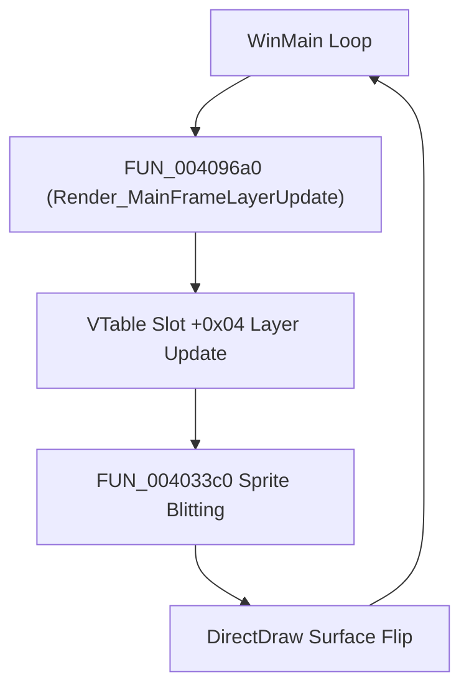

# ALICE GREENFINGERS - GAME LOOP BLUEPRINT (STEP 7)

*Generated on 2026-09-01 13:47:43*

## MAIN RENDER FRAME PIPELINE

```mermaid
graph TD
    A["WinMain Loop"] --> B["FUN_004096a0 (Render_MainFrameLayerUpdate)"]
    B --> C["VTable Slot +0x04 Layer Update"]
    C --> D["FUN_004033c0 Sprite Blitting"]
    D --> E["DirectDraw Surface Flip"]
    E --> A
```
