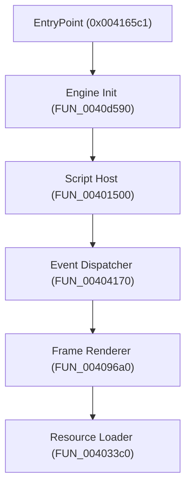

# ALICE GREENFINGERS - SUBSYSTEM CALL GRAPH PARTITION (STEP 12)

*Generated on 2026-09-01 13:42:30*

## SUBSYSTEM INTERACTION DIAGRAM

```mermaid
graph TD
    EntryPoint["EntryPoint (0x004165c1)"] --> EngineInit["Engine Init (FUN_0040d590)"]
    EngineInit --> ScriptHost["Script Host (FUN_00401500)"]
    ScriptHost --> EventLoop["Event Dispatcher (FUN_00404170)"]
    EventLoop --> RenderEngine["Frame Renderer (FUN_004096a0)"]
    RenderEngine --> ArchiveLoader["Resource Loader (FUN_004033c0)"]
```
